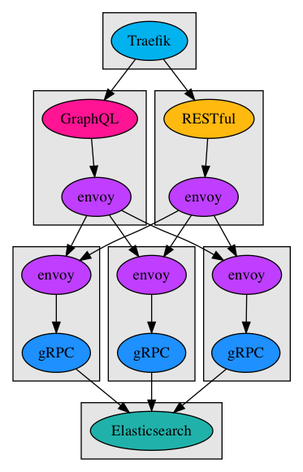

# todo-grpc
a sample Todo [gRPC](https://grpc.io/) application that powers both a [GraphQL](https://graphql.org/) API (using [gqlgen](https://github.com/99designs/gqlgen)) as well as a more traditional RESTful JSON API (powered by [grpc-gateway](https://github.com/grpc-ecosystem/grpc-gateway)), all communicating via an [Envoy](https://www.envoyproxy.io/) service mesh

<p align="center">

</p>

## Installation
*Prerequisites:*
- [go@v1.10](https://golang.org/doc/install)
- [dep@v0.4](https://github.com/golang/dep)
- [retool@v0.82](https://github.com/twitchtv/retool)
- [protoc@v3](https://github.com/google/protobuf)
- [docker@v1.18](https://store.docker.com/search?type=edition&offering=community)
- [docker-compose@v1.22](https://docs.docker.com/compose/install/)
- [a configured go workspace](https://golang.org/doc/code.html)

```shell
# clone this repository
$ git clone https://github.com/cludden/todo-grpc $GOPATH/src/todo-grpc

# install dependencies and sync vendored executables
$ cd $GOPATH/src/todo-grpc && dep ensure -vendor-only && retool sync

# install global plugins
$ go get -u github.com/grpc-ecosystem/grpc-gateway/protoc-gen-grpc-gateway
$ go get -u github.com/grpc-ecosystem/grpc-gateway/protoc-gen-swagger
```

## Documentation
- View the source code documentation at [localhost:6060/pkg/todo-grpc/](http://localhost:6060/pkg/todo-grpc/) with `godoc`:
    ```shell
    $ godoc -http=:6060
    ```

- View the protobuf source at [proto/todo.proto](proto/todo.proto):


- View the gRPC api documentation in your default browser:
    ```shell
    # on macos
    $ open ./docs/index.html

    # on linux
    $ xdg-open ./docs/index.html
    ```

- View the RESTful JSON api documentation at [localhost:8080](http://localhost:8080) with `docker`:
    ```shell
    $ docker run -p 8080:8080 -e SWAGGER_JSON=/todo/todo.swagger.json -v $GOPATH/src/todo-grpc/docs:/todo -it swaggerapi/swagger-ui
    ```

## Getting Started
1. [Build the application](#Building)
   ```shell
    $ retool do goreleaser --snapshot --rm-dist --skip-publish
    ```
2. Run the application with docker
    ```shell
    $ docker-compose up -d elasticsearch && \
        sleep 5s && \
        docker-compose up --scale todo-grpc=3
    ```
3. Explore the RESTful JSON api running at [localhost:11000](http://localhost:11000)
   ```shell
    $ curl localhost:11000/todos
   ```
4. Explore the GraphQL api via the GraphQL Playground running at [localhost:12000](http://localhost:12000)

## Code Generation

```shell
# set protoc path pointing to the root protoc directory (containing bin, include)
$ export PROTOC_PATH=/path/to/protoc

# run protobuf code gen via protoc
$ retool do protoc \
    -I $GOPATH/src/github.com/grpc-ecosystem/grpc-gateway/third_party/googleapis \
    -I $GOPATH/src \
    -I $PROTOC_PATH \
    -I $GOPATH/src/todo-grpc/proto \
    --go_out=plugins=grpc:$GOPATH/src/todo-grpc/proto \
    --grpc-gateway_out=logtostderr=true:$GOPATH/src/todo-grpc/proto \
    --swagger_out=logtostderr=true:$GOPATH/src/todo-grpc/docs \
    --doc_out=$GOPATH/src/todo-grpc/docs \
    --doc_opt=html,index.html \
    todo.proto

# do post processing
$ retool do protoc-go-inject-tag -input=./proto/todo.pb.go

# run graphql code gen via gqlgen
$ retool do gqlgen
```

## Building
```shell
$ retool do goreleaser --snapshot --rm-dist --skip-publish
```

## Todo
- [ ] add tests
- [x] add better error propagation
- [ ] add tls
- [ ] prometheus & grafana
- [ ] add second service & edge proxy

## License
Copyright (c) 2018 Chris Ludden

Licensed under the [MIT License](LICENSE.md)